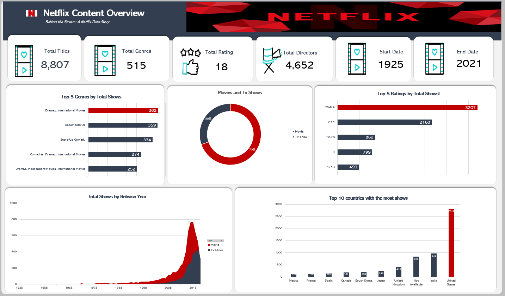

# Netflix-Data-Analysis
An exploratory data analysis project on Netflix Movies &amp; TV Shows using Microsoft Excel. Focused on uncovering content trends, visualizing key metrics, and building an interactive dashboard.

## Project Overview

This project explores Netflix's catalog of Movies and TV Shows using data sourced from [Kaggle](https://www.kaggle.com/shivamb/netflix-shows).  
The dataset contains 12 columns and 8,807 rows, representing various metadata about the content, such as:

- Show ID
- Type (Movie or TV Show)
- Title
- Director
- Cast
- Country
- Date Added
- Release Year
- Rating
- Duration
- Listed In (Genres)
- Description

---

## Objectives

- Understand trends in Netflix's content.
- Analyze content distribution by country, rating, release year, and genre.
- Identify the top contributing countries.
- Visualize key metrics to extract actionable insights.

---

## Tools Used

- Microsoft Excel (Data Cleaning, Analysis & Visualization)

---

## Methodology

### 1. Data Preparation & Cleaning
- Downloaded the dataset from Kaggle in `.csv` format.
- Converted to Excel Workbook for analysis.
- Managed missing values:
  - Replaced missing `Director` names with real values when possible.
  - Remaining gaps were labeled as `"NA"` or `"Not provided"`.
  - Duplicates were removed using Excel’s built-in tools.
- Text standardization was applied (consistent text cases, date formats, etc.).
- Dropped irrelevant columns (e.g., `Description`).

---

### 2. Data Analysis

- Created Pivot Tables to summarize KPIs.
- Focused on genre distribution, rating frequency, content release over time, and country-wise production stats.

---

### 3. Data Visualization

- Designed the layout for the dashboard manually before implementation.
- Used:
  - **Bar Charts** for genres and ratings.
  - **Doughnut Chart** for Movies vs TV Shows ratio.
  - **Stacked Area Chart** for content release trends over years.
  - **Column Chart** for top 10 countries with the most content.
  > **Design Note:**  
> Dark and red-themed visual style was chosen to align with Netflix's brand colors.

---

## Dashboards

The interactive Netflix Data Analysis Dashboard is available in the [`dashboards/`](Netflix excel dashboard.xlsx) folder.

- `Netflix excel dashboard.xlsx`: Full Excel dashboard file.
- `netflix_dashboard.png`: Quick preview of the final visual layout.

Preview:

---

##  Key Insights

- U.S. dominates Netflix’s content library.
- Majority of content is rated for mature audiences (`TV-MA`).
- Significant content growth between 2016 and 2019.
- More Movies than TV Shows on the platform.
- Growing global diversity in content genres.

  ---

## Limitations

- External factors (e.g., competition, global events like COVID-19) were not factored into the dataset.
- User preferences, engagement behavior, and real-world viewership data were beyond the scope.

---

## Recommendations

- **Genre Optimization:** Prioritize popular sub-genres in Drama and Comedy.
- **Content Diversification:** Balance investment between Movies, TV Shows, Documentaries, and regional content.
- **Localization Strategy:** Focus on emerging content markets such as North Africa and Asia.

---

## Next Steps

- Apply these lessons to larger, more complex datasets.
- Continuously improve data handling and visualization techniques in future projects.

